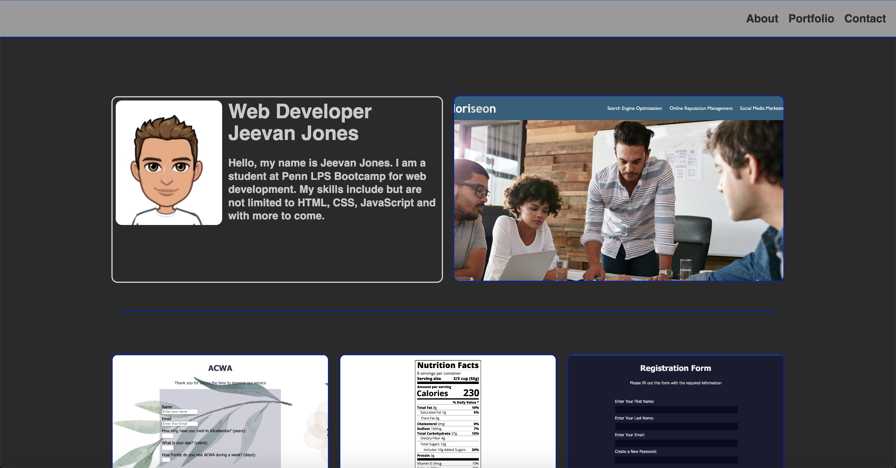

# Hi. I'm Jeevan 👋👨‍💻

## Jeevan Jones Portfolio

[Jeevan Jones Portfolio](https://jeevanmkj.github.io/professional_portfolio/ "Jeevan Jones Portfolio")

I am student at Penn LPS Bootcamp for web development. I am passionate to make web applications more accessible, fun and interactive. Currently my skills include but are not limited to HTML, CSS and JavaScript.

## Find me around the web🌎:

[Linkedin](https://www.linkedin.com/in/jeevan-morgan-kre%C3%9F-jones-140041258/ "Linkedin")

[GitHub](https://github.com/JeevanMKJ "GitHub")

[Instagram](https://twitter.com/JeevanMKJ "Twitter")

[Instagram](https://www.instagram.com/jeevanjones/ "Instagram")

jeevanjones.jmkj@gmail.com

+49 176 40570295
